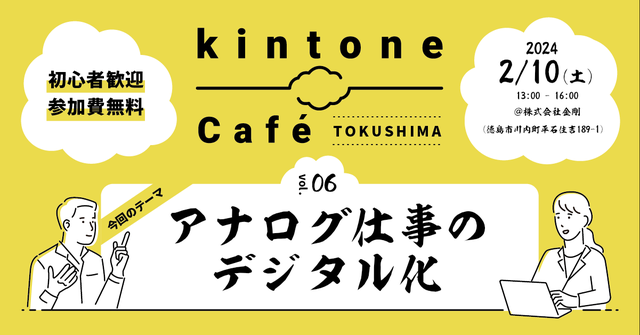
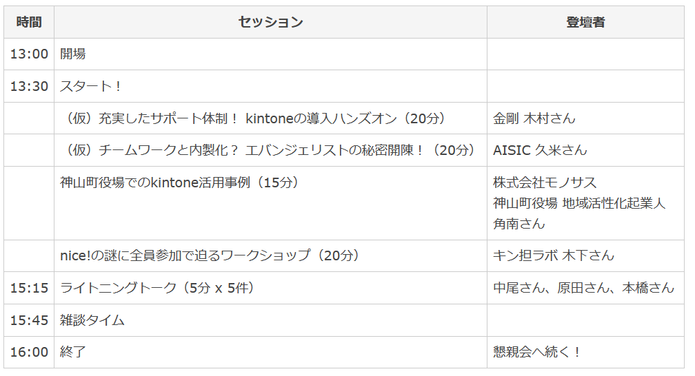
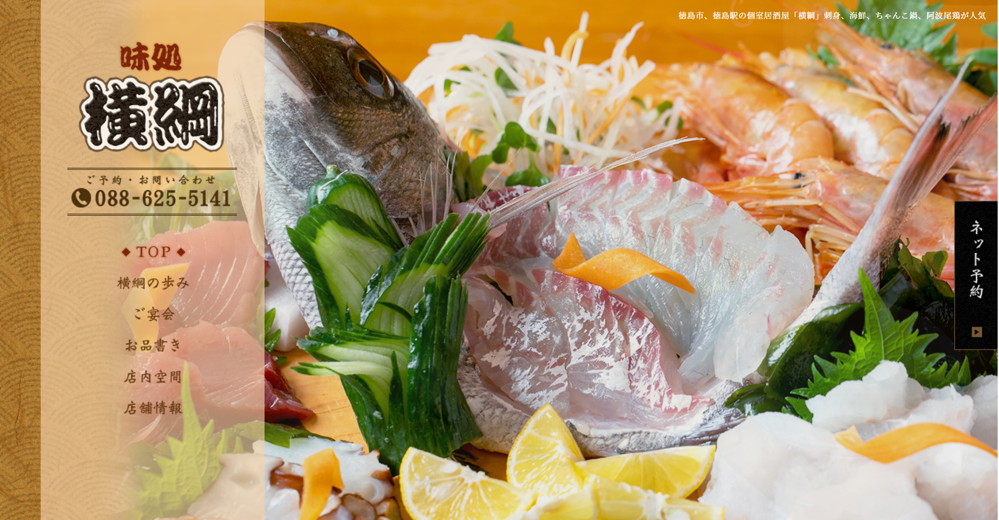
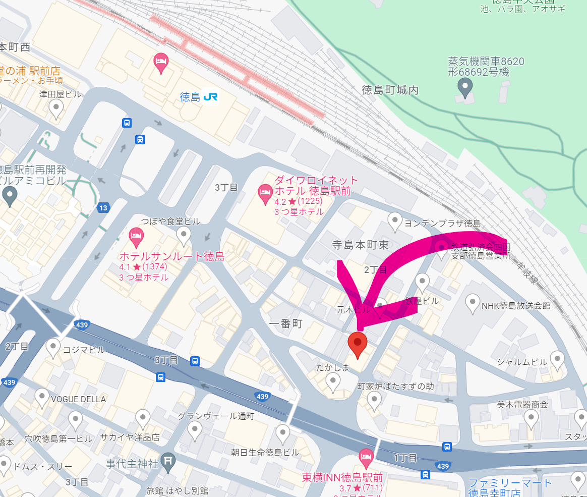

<!-- headingDivider: 1 -->
<!-- - class: normal / blue / green / red / kintone / purple -->
<!-- class: kintone -->

# Wifi
### SSID: wapm-1266r
### PW: kongo1177

#

<!-- # 徳島 Vol.6
 -->

# kintone Café 徳島
## Vol.6
## 2024/2/10
## kintone徳島UG

#

## kintone Caféとは？（理念）
##### kintone Caféは、まだkintoneに触れたことの無い方から、より高度なカスタマイズを行いたいと考えているプロフェッショナルの方まで幅広い層を対象に、 楽しく学び・教え合うことで、kintoneの魅力や活用法をみんなで共有するための勉強会コミュニティです。

#

## kintone Caféが目指すところ
##### kintoneを、今や社会人としての必須スキルであるExcelと同じくらいあるいはそれ以上の存在に育て・普及させていくことを目指します。 

##### また、kintone Caféを核としたkintoneエコシステムを醸成し、コミュニティに参加・貢献する個人とそれを支援する企業にとってメリットのある場にしていきます。

<!-- #

 -->

#
###### 前半
| 時間 | セッション | 登壇者 | 
| --- | --- | --- |
| 13:00 | 開場 | |
| 13:30 | オープニング | キン担ラボ 本橋 |
| 13:40 | ピボットテーブルの脱Excel ＆ クラウド化を "kintone"で解決した話（20分） |  さくら税理士法人 蒲原さん |
| 14:05 | CPaaSとkintoneでDXしよう（20分）| 	KDDIウェブコミュニケーションズ CDX本部　エバンジェリスト 高橋克己さん |
| 14:30 | お悩み解決セッション・前半（15分） | グリーンバレー 後藤さん |
| 14:50 | 休憩(10分) |

#
###### 後半

| 時間 | セッション | 登壇者 | 
| --- | --- | --- |
| 15:00 | 小学校PTAでkintoneを活用してプリントが見えるようになった話（20分）| サイボウズ株式会社 渋谷雄大さん |
| 15:25 | お悩み解決セッション・後半（15分） | 未定 |
| 15:45 | LT1 Customineを使い込んでわかった、kintoneのカスタマイズレアケース　その１(5分) |アールスリーインスティテュート  沖 安隆さん |
| 15:55 | LT2 JPEG画像に含まれるGPS情報をkintoneで活用できないか試してみた (5分) | 株式会社ソフトビレッジ 片岡 幸人さん |
| 16:05 | LT3 (5分) | 株式会社カミノバ 片岡 淳さん |
| 16:15 | 次回 vol.7 開催のご相談 | キン担ラボ 本橋 |
| 16:20 | 終了 | 懇親会へ続く！|

# 本日のセッション

#
## ピボットテーブルの脱Excel ＆ クラウド化を "kintone"で解決した話 
###  さくら税理士法人 蒲原さん 

#
## CPaaSとkintoneでDXしよう
### 	KDDIウェブコミュニケーションズ CDX本部　エバンジェリスト 高橋克己さん 

#
## お悩み解決セッション・前半 
### グリーンバレー 後藤さん 

#
## 小学校PTAでkintoneを活用してプリントが見えるようになった話
### サイボウズ株式会社 渋谷雄大さん 

#
## お悩み解決セッション・後半 
### 公益財団法人
### 徳島県勤労者福祉ネットワーク
### 佐川 寿栄美さん

#
## LT Customineを使い込んでわかった、kintoneのカスタマイズレアケースその１ 
### アールスリーインスティテュート
### 沖 安隆さん 

#
## LT JPEG画像に含まれるGPS情報をkintoneで活用できないか試してみた  
### 株式会社ソフトビレッジ
### 片岡 幸人さん 

#
## LT kintoneで簡単！名刺管理！
### 株式会社カミノバ
### 片岡 淳さん 

# 次回 Vol.7 のご相談

### 9月くらいにやりたいと思ってます。
### 皆様のご予定いかがでしょうか？

#

#

# 懇親会
## 18:00
## 味処 横綱

