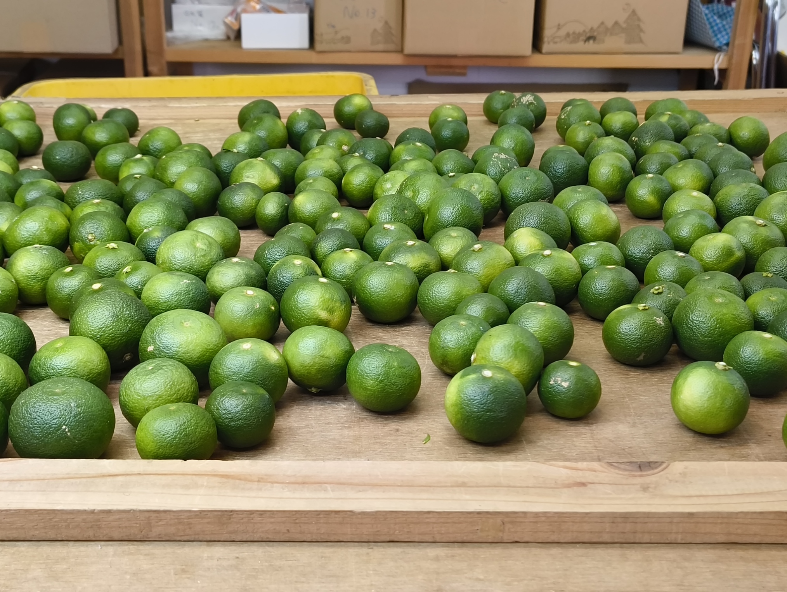

<!-- headingDivider: 1 -->
<!-- - class: normal / blue / green / red / kintone / purple -->
<!-- class: kintone -->

# 
## Wifi
##### SSID: **toecradio-2nd**
##### PW: **monosus-toec-baconepi**

#
## kintone Café 徳島 Vol.7
## スダチの季節

2024/9/14
kintone徳島UG

#

#

<video src="./movie/里山みらい.mp4" width="1024px" controls autoplay></video>

#

>>> 主催: kintone徳島UG (https://kintone-cafe-tokushima.connpass.com/)

<!-- # 徳島 Vol.6
 -->

<!-- # kintone Café 徳島
## Vol.7
## 2024/9/14
## kintone徳島UG -->

#

## kintone Caféとは？（理念）
kintone Caféは、まだkintoneに触れたことの無い方から、
より高度なカスタマイズを行いたいと考えているプロフェッショナルの方まで幅広い層を対象に、 
楽しく学び・教え合うことで、
kintoneの魅力や活用法をみんなで共有するための
勉強会コミュニティです。

#

## kintone Caféが目指すところ
kintoneを、今や社会人としての必須スキルであるExcelと同じくらいあるいはそれ以上の存在に育て・普及させていくことを目指します。 

また、kintone Caféを核としたkintoneエコシステムを醸成し、コミュニティに参加・貢献する個人とそれを支援する企業にとってメリットのある場にしていきます。

<!-- 
# kintone Café 徳島で目指したいところ

多くの方にkintone Caféの存在を知っていただき、
参加すれば知りたいことが知れて聞きたいことが聞けて、
最新情報を交換し会えるサロンとして機能している場が、
**徳島にも**ほしい。

# kintone Café 徳島で目指したいところ（情緒）

気軽に参加できて、
ゆるく手札を持ち寄れて、
持ってる課題を見せあって、
みんなで美味しいものを食べる

そういう会を**徳島で**定期的に持ちたい。 -->

#

<!-- class: font-small -->
###### 前半

| 時間  | セッション                                   | 登壇者                 |
| ----- | -------------------------------------------- | ---------------------- |
| 13:00 | 開場利用の予約時間                           |                        |
| 13:15 | 受付開始                                     |                        |
| 13:45 | オープニング                                 | キン担ラボ 本橋        |
| 13:50 | **フリースタイル発表会・前半** （20分）          | みなさま               |
| 14:10 | **お悩み解決セッション・前半** （15分）          | グリーンバレー後藤さん |
| 14:30 | **kintone hack 2024 報告 & kinToys紹介** （20分）| 本橋                   |
| 14:50 | 休憩(10分)                                   |                        |

# フリースタイル発表会
## テーマ: 自由研究
<!-- class: kintone -->

#### kintoneについて気になる話題、調べたり試してみたこと、
#### ひとことふたこと添えて共有してください。
#### 聞いてる側も、
#### ひとことふたことコメントしてください。

#
<!-- class: font-small -->
###### 後半

| 時間  | セッション                         | 登壇者          |
| ----- | ---------------------------------- | --------------- |
| 15:00 | **フリースタイル発表会・後半**（20分） | みなさま        |
| 15:20 | **お悩み解決セッション・後半**（15分） | 募集中          |
| 15:35 | **LT1 □い芸人 高橋さん** (10分)        |                 |
| 15:45 | **LT2 募集中** (10分)                   |                 |
| 15:55 | **LT3 募集中** (10分)                   |                 |
| 16:05 | 次回 vol.8 開催のご相談            | キン担ラボ 本橋 |
| 16:20 | 終了                               | 懇親会へ続く！  |

# 次回 Vol.8 のご相談
<!-- class: kintone -->
#### 2025年2月くらいにやりたいと思ってます。
#### 皆様のご予定いかがでしょうか？

#

#

# 懇親会
## 18:00
## 居酒屋とくさん

